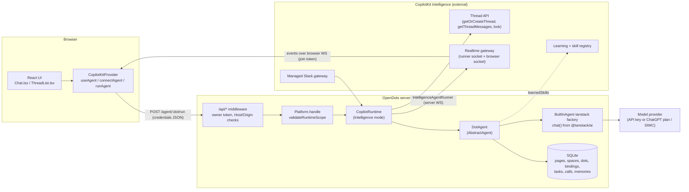
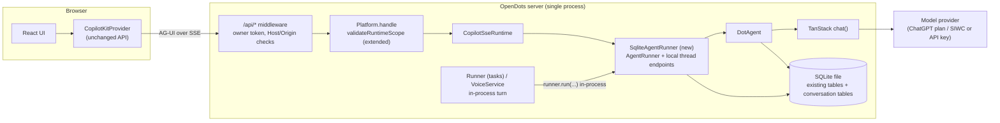

# Local-first feasibility: removing the CopilotKit Intelligence dependency (Phase 7)

**Status:** investigation only. No production code, tests, dependencies, or configuration were changed. No PoC was built. No external request was sent. No `.env` file was opened and no Intelligence credential was looked for. The test suite was not run (nothing it covers changed).

**P1 closeout update:** PoC P1 (offline SSE acceptance) is **completed: PASS** on Node 24.14.1. All of P1-1 to P1-8 pass, including the dedicated usage-limit UX after a small client fix. Details and evidence: [`LOCAL_FIRST_P1_ACCEPTANCE.md`](LOCAL_FIRST_P1_ACCEPTANCE.md). The preliminary verdict stays **CONDITIONAL GO** and the L3 assessments are unchanged. Still open: P2a, P2b, P3, P5, and U6 (exact version pin plus contract test). The rest of this document is the original investigation text and has not been rewritten.

**要約（日本語）:** OpenDots から CopilotKit Intelligence への必須依存を外す構成は、**条件付きで実現可能（CONDITIONAL GO）**。決め手は、導入済みの `@copilotkit/runtime@1.75.0` に Intelligence を使わない SSE モード（`CopilotSseRuntime`、`intelligence` を渡さなければ自動選択）と、差し替え可能な公開クラス `AgentRunner` がすでにあること。ただし標準の `InMemoryAgentRunner` は永続化されないため、SQLite 版の runner を OpenDots 側で用意する必要がある。Automatic Learning / learned skills と、Intelligence 管理の Slack Channels は現状のままでは移行できない。詳細は以下（本文は英語、リポジトリ内の他の docs に合わせた）。

## How to read this document

Every claim carries one of four labels:

| Label            | Meaning                                                                                        |
| ---------------- | ---------------------------------------------------------------------------------------------- |
| **Confirmed**    | Read directly in this repository's source or in the installed package source/types.            |
| **Likely**       | Follows from code that was read, but the behavior was not executed.                            |
| **Unknown**      | Cannot be determined from static inspection (and often not even by a PoC without live access). |
| **Requires PoC** | Can be settled only by running something. Listed in [Required PoCs](#11-required-pocs).        |

References:

- `path:line` is this repository at commit `d144e9c` (branch `feat/chatgpt-plan-provider`).
- `runtime:…`, `core:…`, `react-core:…`, `channels:…` are the installed packages `@copilotkit/runtime@1.75.0`, `@copilotkit/core@1.75.0`, `@copilotkit/react-core@1.75.0`, and `@copilotkit/channels*@0.11.0` under `node_modules/`. Line numbers refer to this exact build and will drift.
- "Public" means exported from a documented entry point (`@copilotkit/runtime/v2`, `@copilotkit/react-core/v2`, …). "Semi-public" means exported and typed, but gated by a `ɵ`-prefixed (internal-by-convention) name. "Internal" means reachable only through deep imports or `ɵ` members.

## 1. Executive summary

**Preliminary verdict: CONDITIONAL GO** (see [section 13](#13-preliminary-verdict)).

1. **The vendor already ships a non-Intelligence mode.** `new CopilotRuntime({...})` without `intelligence` becomes a `CopilotSseRuntime` (`runtime:core/runtime.mjs:139`). In that mode, `run`, `connect` and `stop` flow over plain AG-UI SSE through a pluggable `AgentRunner` (`runtime:handlers/sse/run.mjs`, `connect.mjs`). Thread list/messages/events/state are served from the runner when it advertises local thread endpoints (`runtime:handlers/intelligence/threads.mjs:63,191,240,269`). Confirmed.
2. **Durability is ours to build.** The default runner is `InMemoryAgentRunner`, which is process-global, LRU-bounded and explicitly "non-durable by design" (`runtime:runner/in-memory.mjs:58`). No SQLite runner ships in 1.75.0 (searched `runtime/dist`; the only hit is a vendor error message that mentions "a SQLite runner", `runtime:core/runtime.mjs:80`). `AgentRunner` is a public abstract class and `CopilotSseRuntimeOptions.runner` is public, so a SQLite runner is an adapter replacement, not a fork. Confirmed. The final storage schema is deliberately **not** fixed in this phase (section 10).
3. **OpenDots' own surface is small.** Intelligence is used functionally by 9 server files (3 more mention it only in error text). The client never references Intelligence by name; it depends on it through `setup.missing`, `useThreads` and the runtime's mode (section 4). All non-conversation data (Pages, Spaces, Dots, settings, memories, thread bindings, scheduled work, voice receipts, computer permissions) is **already SQLite** (section 5). The only durable conversation payload not already local is **message/event history**. Thread-record behavior (ownership, title, listing) is replaced by the existing local bindings plus the local runner; Intelligence-generated titles and the transient thread lock have no local counterpart and need replacement behavior, not data migration.
4. **What cannot be preserved as-is:** Automatic Learning and learned-skill delivery (Intelligence-side pipeline and registry), the managed Slack gateway (Intelligence holds the Slack connection; OpenDots has no Slack tokens), Intelligence-generated thread titles, and thread realtime/mutation endpoints.
5. **"No Intelligence dependency" will be true at runtime and configuration level, not at package level.** `@copilotkit/runtime` still contains the Intelligence client and `phoenix`-based code. It simply is never instantiated.
6. **A second CopilotKit egress exists even in SSE mode.** The runtime sends anonymous telemetry via `lambdaClient` (`runtime:telemetry/telemetry-client.mjs:66`, host `https://telemetry.copilotkit.ai` in `@copilotkit/shared`) unless `COPILOTKIT_TELEMETRY_DISABLED` or `DO_NOT_TRACK` is set. Nothing in this repository sets either (searched `src`, `docs`, `deployment`, compose files, `Dockerfile`, `README.md`, `.env.example`). Local-first must set it. Confirmed.
7. **Largest unresolved technical risk:** whether encrypted reasoning items needed by the stateless ChatGPT-plan path survive a persist/replay round trip through the AG-UI event log (section 10, U2). Offline PoC P2a can prove the data is stored and replayed faithfully; only a minimal live acceptance test (P2b, run after P2a, using the existing Keychain session) can prove OpenAI accepts the replayed items.

Feasibility scores (scale defined in [section 12](#12-feasibility-levels)):

| Area                                         | Level                                            |
| -------------------------------------------- | ------------------------------------------------ |
| Core chat                                    | **L3**                                           |
| Core Dots experience                         | **L3**                                           |
| Local conversation persistence               | **L3**                                           |
| Background work (scheduled tasks, voice job) | **L3**                                           |
| Slack                                        | **L2** (low confidence)                          |
| Voice                                        | **L3**                                           |
| Automatic Learning                           | **L1** (L0 "as-is")                              |
| Full current-feature parity                  | **L1** (L3 excluding Learning and managed Slack) |

## 2. Scope and method

What was inspected:

- Every file under `src/` that mentions Intelligence, plus every importer of `Platform`, `DotAgent`, `WorkspaceStore`, `PageService`, `VoiceService` and the runtime handler.
- Installed `@copilotkit/runtime`, `core`, `react-core`, `channels`, `channels-core`, `channels-slack`, `channels-intelligence` (types, `.d.mts`, and the shipped `.mjs`).
- Repository docs (`README.md`, `SECURITY.md`, `docs/SETUP.md`, `docs/CHATGPT_PLAN*.md`, `compose.yml`).

What was **not** done: no server was started, no browser was driven, no test was run, no request left the machine, and no document in `docs/` other than this one was edited.

Explicit non-goals of this phase: choosing a final design, estimating schedule, or deciding the product story for Learning and Slack.

## 3. Architecture before

### 3.1 Browser to model, as the code stands



Step by step (all Confirmed unless noted):

1. `App.tsx:929` mounts `CopilotKitProvider runtimeUrl="/api/copilotkit" headers={authHeaders()}`.
2. `Chat.tsx:63` creates an agent with `useAgent({agentId: 'chat-<thread>', runtimeAgentId: dot.id, threadId})`. `Chat.tsx:123` calls `copilotkit.connectAgent` (history replay), `Chat.tsx:157` calls `copilotkit.runAgent`, `Chat.tsx:453` calls `copilotkit.stopAgent`.
3. The request reaches Hono through `app.all('/copilotkit/*')` (`src/server/workspace-routes.ts:202`) after the `/api/*` middleware in `src/server/app.ts` (owner bearer token, Host allowlist, Origin and `Sec-Fetch-Site` checks, JSON-only, 1 MB body limit).
4. `Platform.handle` (`src/server/platform.ts:151`) rejects with 503 when no handler exists (no `INTELLIGENCE_API_KEY`), runs `validateRuntimeScope` (`src/server/runtime-scope.ts`), then `handler.fetch`.
5. The handler is `createCopilotHonoHandler({runtime, basePath: '/api/copilotkit'})` (`platform.ts:81`) over `new CopilotRuntime({intelligence, identifyUser, agents, channels, generateThreadNames})` (`platform.ts:63`). Because `intelligence` is present, this is `CopilotIntelligenceRuntime` (`runtime:core/runtime.mjs:139`).
6. On `agent/:id/run` the runtime resolves the user via `identifyUser`, calls `intelligence.getOrCreateThread`, acquires a thread lock with `ɵacquireThreadLock`, fetches history to de-duplicate input messages, then runs `IntelligenceAgentRunner` (`runtime:handlers/intelligence/run.mjs:58,83,128`). The `run` response to the browser is **JSON credentials** (join token, `realtime.clientUrl`, `topic`), not an event stream (`core:index.mjs:316-345`, `1221-1232`).
7. The runner executes **`DotAgent`** (`src/server/dot-agent.ts`) in the OpenDots process. `DotAgent` wraps a `BuiltInAgent({type: 'tanstack', factory})` that calls TanStack `chat({adapter, tools, …})` (`dot-agent.ts:195-246`). The adapter is the provider snapshot taken once per run (`model-provider.ts`, `chatgpt-plan.ts`).
8. Events travel `DotAgent → IntelligenceAgentRunner → Intelligence realtime → browser WebSocket`. The browser joins that socket directly; this is why the CSP allows the Intelligence WS origin (`src/server/index.ts:116-137`).

Headless path (scheduled tasks, voice compute, call receipts):

`Runner.tick` (`src/server/runner.ts`) → `platform.turn` (`index.ts:112`) → `runThreadTurn` (`src/server/headless.ts:23`) → loopback `GET {runtimeUrl}/info` which must report `mode: 'intelligence'` (`headless.ts:17,36`) → Node `IntelligenceAgent` over the Intelligence WebSocket (`headless.ts:41`) → the same runtime and `DotAgent`. A "local" background turn therefore currently round-trips through Intelligence.

Slack path:

Slack → Intelligence managed gateway → runtime `ChannelManager` → `runCanonicalChannelAgent` (lock, learning container selector, `getThreadMessages`) (`runtime:core/channel-manager.mjs:129,204-321`) → `DotAgent(channel=true)` (`platform.ts:56-58`). OpenDots holds no Slack bot or app token; the channel is addressed by name (`SLACK_CHANNEL_NAME`) and the Intelligence project owns the Slack connection (`docs/SETUP.md:74-100`).

## 4. Dependency inventory

Classification columns:

- **Hard / Optional:** whether OpenDots stops working for that capability without Intelligence.
- **Kind:** _runtime_ (execution depends on it), _storage_ (data lives there), _transport_ (bytes flow through it), _identity_ (authN/authZ), _config_ (setup gating only).

### 4.1 Configuration and gating

| #   | Symbol / location                                                                                                | Role                                                                                                                                                                                            | Hard / Optional | Kind              |
| --- | ---------------------------------------------------------------------------------------------------------------- | ----------------------------------------------------------------------------------------------------------------------------------------------------------------------------------------------- | --------------- | ----------------- |
| 1   | `INTELLIGENCE_API_KEY` → `PlatformConfig.intelligenceKey` (`index.ts:67`, `platform-config.ts:4`)                | The single switch. Absent ⇒ no handler, no conversations                                                                                                                                        | **Hard**        | config + identity |
| 2   | `setupStatus().missing` includes `'INTELLIGENCE_API_KEY'` (`platform-config.ts:35`), `intelligence` flag (`:51`) | Blocks `/conversations` (503, `workspace-routes.ts:130-134`), scheduled-task creation (`app.ts`), page chat and setup UI (`App.tsx:175`, `PageConversation.tsx:125`, `WorkspaceDialog.tsx:382`) | **Hard**        | config            |
| 3   | `INTELLIGENCE_API_URL` → `intelligenceApiUrl` (`index.ts:68`; used `platform.ts:42`, `dot-agent.ts:202`)         | Endpoint override; default is the managed cloud                                                                                                                                                 | Optional        | transport         |
| 4   | `INTELLIGENCE_WS_URL` → `intelligenceWsUrl` (`index.ts:69`; used `platform.ts:43`, CSP `index.ts:116-137`)       | Realtime override; default `wss://realtime.intelligence.copilotkit.ai`                                                                                                                          | Optional        | transport         |
| 5   | `compose.yml:12-14`, `docs/SETUP.md:32-33`, `README.md:125`                                                      | Documented deployment surface                                                                                                                                                                   | docs            | config            |

### 4.2 Server

| #   | Symbol / location                                                                                                                                                         | Role                                                                                                                                                            | Hard / Optional                                                        | Kind                           |
| --- | ------------------------------------------------------------------------------------------------------------------------------------------------------------------------- | --------------------------------------------------------------------------------------------------------------------------------------------------------------- | ---------------------------------------------------------------------- | ------------------------------ |
| 6   | `new CopilotKitIntelligence` (`platform.ts:40`)                                                                                                                           | Platform client: threads, lock, history                                                                                                                         | **Hard**                                                               | storage + runtime              |
| 7   | `new CopilotRuntime({intelligence, identifyUser, …})` (`platform.ts:63-80`)                                                                                               | Selects Intelligence mode; user identity (`identifyUser` returns the constant owner); title generation                                                          | **Hard** (mode flips to SSE if `intelligence` omitted)                 | runtime + identity             |
| 8   | `createCopilotHonoHandler` (`platform.ts:81`)                                                                                                                             | HTTP adapter. Mode-agnostic                                                                                                                                     | Keep                                                                   | transport                      |
| 9   | `Platform.createConversation` → `intelligence.createThread` (`platform.ts:116-132`)                                                                                       | Creates the remote thread record, then `workspace.bindThread`                                                                                                   | **Hard**                                                               | storage                        |
| 10  | `Platform.history` → `getThreadMessages` (`platform.ts:134-149`)                                                                                                          | Last 12 user/assistant texts (≤ 12 000 chars) for voice context                                                                                                 | **Hard**                                                               | storage                        |
| 11  | `Platform.turn` → `runThreadTurn` (`platform.ts:178`, `headless.ts`)                                                                                                      | Every server-initiated turn                                                                                                                                     | **Hard**                                                               | runtime + transport            |
| 12  | `runtimeInfoSchema` requires `mode: 'intelligence'` and `intelligence.wsUrl` (`headless.ts:17-21`), `new IntelligenceAgent` (`:41`)                                       | Node-side Intelligence client. Would reject an SSE runtime                                                                                                      | **Hard**                                                               | transport                      |
| 13  | `validateRuntimeScope` (`runtime-scope.ts`)                                                                                                                               | OpenDots-owned authorization in front of the runtime. Allow-list includes Intelligence-only routes (`threads/subscribe`, `PATCH`/`DELETE`/`archive` on threads) | Keep, edit                                                             | identity                       |
| 14  | `DotAgent.run` guard `!config.intelligenceKey` (`dot-agent.ts:84`)                                                                                                        | Refuses to run without the key                                                                                                                                  | **Hard** (trivial to drop)                                             | config                         |
| 15  | `DotAgent` `learnedSkills: {containers, apiKey, apiUrl}` (`dot-agent.ts:195-203`), `ctx.learnedSkills.catalog` (`:221`), `learnedSkillTools` (`tanstack-tools.ts`)        | Pulls published skills from the Intelligence registry                                                                                                           | Optional (guarded by `skillDeliveryEnabled && learningContainerId`)    | runtime                        |
| 16  | `learningSelector` → `getLearningContainerId` (`learning.ts`, `platform.ts:44`)                                                                                           | Chooses the Learning container; **also** binds new Slack threads as a side effect (`learning.ts` channel branch)                                                | Optional for Learning; the binding side effect is **needed** for Slack | identity + storage (binding)   |
| 17  | `PageService` port `PageIntelligence` (`page-service.ts:5-15`); `getOrCreateThread` (`:71`); `getThreadMessages` (`:105`); 30 s `bounded` (`:16`)                         | Page chat creation and "save conversation to page"                                                                                                              | **Hard**                                                               | storage                        |
| 18  | `VoiceService`: `requireReady` (`voice.ts:33`), `history` (`:65`), compute → `turn` (`:184`), receipt → `turn` (`:222`), "pending Intelligence sync" strings (`:217,237`) | Voice context, compute delegation, transcript receipt written into the thread                                                                                   | **Hard** for compute and receipts                                      | runtime + storage              |
| 19  | Scheduled work: `Runner` execute callback → `platform.turn` (`index.ts:105-114`); legacy-task error text (`:109`)                                                         | Every scheduled turn runs inside an Intelligence conversation                                                                                                   | **Hard**                                                               | runtime                        |
| 20  | Slack: `createSlackChannel` + `channels` in the runtime (`platform.ts:47-62`, `slack-channel.ts`); `handler.channels.ready/stop` (`platform.ts:102-115`)                  | Channel definition. The connection, tokens, dedup and lock are Intelligence-managed                                                                             | **Hard** for Slack; optional overall                                   | runtime + transport + identity |
| 21  | CSP `connect-src 'self' ${wsOrigin}` (`index.ts:116-137`)                                                                                                                 | Lets the browser reach the Intelligence socket                                                                                                                  | Hard while Intelligence is used                                        | transport                      |

### 4.3 Client

| #   | Symbol / location                                                                                      | Role                                                                                                                                                                    | Hard / Optional | Kind      |
| --- | ------------------------------------------------------------------------------------------------------ | ----------------------------------------------------------------------------------------------------------------------------------------------------------------------- | --------------- | --------- |
| 22  | `CopilotKitProvider runtimeUrl` (`App.tsx:929`)                                                        | Mode-agnostic. The client learns the mode from `/info`                                                                                                                  | Keep            | transport |
| 23  | `useAgent`, `connectAgent`, `runAgent`, `stopAgent`, `useHumanInTheLoop`, `useRenderTool` (`Chat.tsx`) | AG-UI client. Mode-agnostic API; the delegate chosen underneath differs (`core:index.mjs:994-1037`)                                                                     | Keep            | transport |
| 24  | `useThreads` (`ThreadList.tsx:19`)                                                                     | **Decorative.** The list is rendered from `local` (workspace bindings, `ThreadList.tsx:42`); `remote?.name` only overrides the title with Intelligence's generated name | Optional        | storage   |

### 4.4 Not Intelligence-dependent (verified by search and read)

`src/browser/*` (research browser service), `computer-service.ts`, `computer-store.ts`, `computer-tools.ts`, `computer-routes.ts`, `research.ts`, `store.ts` (tasks, memories, settings), `pages.ts`, `page-tools.ts`, `model-*.ts`, `chatgpt-*.ts`, `credential-*.ts`, `sealed-encryption.ts`, `private-fs.ts`. OpenDots does **not** use Intelligence Memory (`memory` is not passed to `CopilotRuntime`); its "memories" are local rows injected into the system prompt (`dot-agent.ts`, `store.ts`).

### 4.5 Call paths

Each path is traced through the code, not grepped.

**New conversation.** `POST /api/conversations` → `workspaceRoutes` (`workspace-routes.ts:120-137`) → `setup().missing` gate → `Platform.createConversation` → `intelligence.createThread` → `WorkspaceStore.bindThread`. Local effect is one `thread_bindings` row; remote effect is the thread record.

**Send a message.** `Chat.send` → `agent.addMessage` + `copilotkit.runAgent` → runtime run → `DotAgent.run` → `workspace.requireThread(threadId, dot.id)` (`dot-agent.ts:66-80`, a second thread-ownership check behind `validateRuntimeScope`) → TanStack loop. After the run `onSaved()` refreshes workspace state.

**Reload / resume.** `connectAgent` → runtime `agent/:id/connect` → Intelligence replays history to the browser. The browser rebuilds the transcript (messages, tool-call cards, HITL cards, voice-receipt anchors) from that replay.

**Page chat.** `POST /spaces/:s/pages/:p/conversation` → `PageService.conversation` (`page-service.ts:46-95`) → local lease (`pages.reserveThread`) → `intelligence.getOrCreateThread` → `bindThread` → `finishThread`. Conversation context for the model comes from `pageAccess(...).context()` in `DotAgent` (local SQLite).

**Save conversation to page.** `POST /conversations/:id/page` → `PageService.saveConversation` → `getThreadMessages` → text extraction (`page-service.ts:97-140`) → `pages.create(..., sourceThreadId)`.

**Scheduled run.** `Runner.tick` → `Store.claim` (local lease) → `workspace.taskThread(task.id)` → `platform.turn`. The prompt is the only message sent (`headless.ts:63-70`, no `connectAgent`), and the run handler builds the agent's input from that request without merging stored history (`canonicalInput`, `runtime:handlers/intelligence/run.mjs`). The agent runs inside the OpenDots process, so Intelligence has no way to add history to it. Confirmed: a background turn sees the system prompt plus the single prompt.

**Voice.** `POST /voice/calls` → `VoiceService.begin` → `platform.history` → OpenAI Realtime (separate `VOICE_API_KEY`). `ask_compute` → `platform.turn`. `end` → `syncReceipt` → `platform.turn` with a receipt prompt.

**Slack.** See section 3.1.

## 5. Data ownership

| Data                                                                    | Where it lives today                                                                                                                                               | Evidence                                                   |
| ----------------------------------------------------------------------- | ------------------------------------------------------------------------------------------------------------------------------------------------------------------ | ---------------------------------------------------------- |
| Spaces                                                                  | SQLite `spaces`                                                                                                                                                    | `workspace.ts:20`                                          |
| Dots (name, instructions, flags, default Space)                         | SQLite `dots`, `dot_spaces`                                                                                                                                        | `workspace.ts:21,48`                                       |
| Dot learning settings                                                   | SQLite columns `dots.learningContainerId`, `skillDeliveryEnabled` (a local pointer to an Intelligence container)                                                   | `workspace.ts:27-37`                                       |
| Pages                                                                   | SQLite `pages`                                                                                                                                                     | `pages.ts:46`                                              |
| Page ↔ conversation                                                     | SQLite `page_threads`, `pages.sourceThreadId`, `page_reviews`                                                                                                      | `pages.ts:44-47`                                           |
| Settings (paused, research, memory flags)                               | SQLite `settings`                                                                                                                                                  | `store.ts:30`                                              |
| Memories (owner preferences)                                            | SQLite `memories`                                                                                                                                                  | `store.ts:34`                                              |
| Model selection                                                         | SQLite `model_selection` (names only, never keys)                                                                                                                  | `store.ts:35`                                              |
| Model credentials (ChatGPT plan)                                        | **Not SQLite:** DevKit state directory / OS keychain / ephemeral memory                                                                                            | `index.ts:36-60`                                           |
| Thread bindings (id, Dot, owner, title, frozen container)               | SQLite `thread_bindings`                                                                                                                                           | `workspace.ts:22`                                          |
| Thread record on the platform (name, agent, user, archived, timestamps) | **Intelligence**                                                                                                                                                   | `platform.ts:121`; `threads.mjs` handlers                  |
| Auto-generated thread name                                              | **Intelligence only** (`generateThreadNames: true`, `platform.ts:79`)                                                                                              | `runtime:handlers/intelligence/run.mjs:58-70`              |
| **Messages** (user / assistant)                                         | **Intelligence.** No `messages` table exists in any `CREATE TABLE` in `src/`                                                                                       | `platform.ts:134-149`, `page-service.ts:104`               |
| **Tool calls and tool results**                                         | **Intelligence** (inside AG-UI events/messages). Local derivatives only: `captures` (browser research per thread), `page_reviews` (HITL receipt), `computer_audit` | `workspace.ts:25`, `pages.ts:44`, `computer-store.ts:10`   |
| Scheduled work (tasks, runs, events, task↔thread)                       | SQLite `tasks`, `runs`, `events`, `task_threads`                                                                                                                   | `store.ts:31-33`, `workspace.ts:23`                        |
| Voice calls (status, transcript, anchor message id)                     | SQLite `calls`. The transcript receipt inside the thread is on **Intelligence**                                                                                    | `workspace.ts:24`, `voice.ts:212-232`                      |
| Computer permissions and audit                                          | SQLite `computer_permissions`, `computer_audit`                                                                                                                    | `computer-store.ts:9-10`                                   |
| In-flight run state, thread lock                                        | **Intelligence** (Redis-backed lock) plus transient in-process state (`DotAgent.controller`, `PageService.pending`, `VoiceService.jobs`)                           | `runtime:handlers/intelligence/run.mjs:83`                 |
| Learning state (containers, analysis, skills, publication)              | **Intelligence**                                                                                                                                                   | `docs/SETUP.md:138-178`                                    |
| Slack conversation state                                                | **Intelligence** (managed adapter). The channel's own `store` is the default in-memory store                                                                       | `slack-channel.ts` (`store: {concurrency: 'serial'}` only) |
| Realtime join credentials                                               | **Intelligence**, transient                                                                                                                                        | `core:index.mjs:419-429`                                   |

Consequence: `docs/SETUP.md:55` already tells operators to back up two storage layers. Removing Intelligence collapses that to one file, but that file then contains conversation transcripts (new at-rest sensitivity, section 9).

## 6. Runtime and transport

### 6.1 What the installed CopilotKit 1.75.0 provides

| Capability                                                                                             | Present?              | Evidence                                                                                                                                                                                                                                                                                                         | API status                                          |
| ------------------------------------------------------------------------------------------------------ | --------------------- | ---------------------------------------------------------------------------------------------------------------------------------------------------------------------------------------------------------------------------------------------------------------------------------------------------------------- | --------------------------------------------------- |
| Local / SSE runtime                                                                                    | **Yes**               | `CopilotSseRuntime` (`runtime:core/runtime.mjs:61-69`); the `CopilotRuntime` shim picks it when `intelligence` is absent (`:139`)                                                                                                                                                                                | **Public** (exported from `@copilotkit/runtime/v2`) |
| `CopilotSseRuntime`                                                                                    | **Yes**               | Typed in `core/runtime.d.mts` with `runner?`, `intelligence?: undefined`, `channels?: undefined`, `generateThreadNames?: undefined`                                                                                                                                                                              | **Public**                                          |
| AG-UI path without Intelligence                                                                        | **Yes**               | `handleSseRun` / `handleSseConnect` stream AG-UI events as SSE; client side is `ProxiedCopilotRuntimeAgent extends HttpAgent` (`core:index.mjs:762`, `#runViaHttp`, `#connectViaHttp`)                                                                                                                           | **Public**                                          |
| Custom agent                                                                                           | **Yes**               | `agents: AgentsConfig` accepts any `AbstractAgent` (OpenDots' `DotAgent` already does)                                                                                                                                                                                                                           | **Public**                                          |
| Custom runner                                                                                          | **Yes**               | `AgentRunner` is an exported abstract class (`run`, `connect`, `isRunning`, `stop`); `CopilotSseRuntimeOptions.runner` (`runtime.d.mts`). The vendor's own error text says to drop `intelligence` "to run in SSE mode with a runner you control" and calls out "a SQLite runner" (`runtime:core/runtime.mjs:80`) | **Public**                                          |
| Local thread endpoints (list, messages, events, state)                                                 | **Yes**               | `LocalThreadEndpointRunner` interface and `supportsLocalThreadEndpoints()` are exported; the capability marker is `ɵsupportsLocalThreadEndpoints` (`agent-runner.d.mts`)                                                                                                                                         | **Semi-public** (type exported, marker is `ɵ`)      |
| Run-finalisation helpers for custom runners                                                            | **Yes**               | `createRunEventFinalizer`, `finalizeRunEvents` re-exported; `compactEvents`, `defaultApplyEvents` exported by `@ag-ui/client`                                                                                                                                                                                    | **Public**                                          |
| Bundled durable runner (SQLite or other)                                                               | **No**                | Search of `runtime/dist` finds none                                                                                                                                                                                                                                                                              | n/a                                                 |
| `InMemoryAgentRunner`                                                                                  | Yes                   | Process-global `ɵGLOBAL_STORE`; `maxThreads`, `maxRunsPerThread`, `maxBytes`; non-durable (`runtime:runner/in-memory.mjs:58`)                                                                                                                                                                                    | **Public** class; store is `ɵ`                      |
| `useThreads` against an SSE runtime                                                                    | Degrades gracefully   | List works when the runner supports local endpoints; `mutations` is `false`; no realtime (`wsUrl` undefined) (`react-core:v2/headless.mjs:1393-1480`, `runtime:handlers/get-runtime-info.mjs:128-136`)                                                                                                           | **Public**                                          |
| `identifyUser`, `memory`, `channels`, `ɵlearning`, thread names, thread subscribe/PATCH/DELETE/archive | **Intelligence only** | `runtime:core/runtime.mjs:64-65`, `runtime:core/runtime.mjs:173-175`; thread mutations return 422 without Intelligence (`threads.mjs:18-21`); `/info` reports `mutations: false`                                                                                                                                 | n/a                                                 |
| Slack/Channels without Intelligence                                                                    | **Partially**         | Runtime refuses `channels` in SSE mode. Direct adapters exist (`slack({botToken, appToken})` over Bolt Socket Mode) but their lifecycle is `channel.ɵruntime.start()`, documented "no public equivalent; channels are runtime-driven only" (`channels-core:create-channel.d.ts`)                                 | Adapter **public**; lifecycle **internal**          |
| Learned skills without Intelligence                                                                    | **No**                | `BuiltInAgent.learnedSkills` reads a remote registry via `CopilotKitIntelligence`/`apiKey`/`apiUrl` (`skill-registry/config.d.mts`); with no registry the factory context is simply empty (`runtime:agent/learned-skills.mjs:29`)                                                                                | n/a                                                 |

### 6.2 Behavioral differences between the two modes (relevant to OpenDots)

| Aspect                              | Intelligence mode (today)                                              | SSE mode (candidate)                                                                                                               | Label                 |
| ----------------------------------- | ---------------------------------------------------------------------- | ---------------------------------------------------------------------------------------------------------------------------------- | --------------------- |
| Event delivery to browser           | Server → Intelligence → browser WebSocket                              | Server → browser SSE response (`sse-response.mjs`), 15 s keep-alive default                                                        | Confirmed             |
| Source of history on `connect`      | Intelligence                                                           | `runner.connect()` (compacted events of past runs, plus the live subject if a run is active) (`in-memory.mjs`)                     | Confirmed             |
| Input de-duplication                | Server filters input messages against platform history (`run.mjs:128`) | Runner de-duplicates by message id in `historicMessageIds` (`in-memory.mjs:320`)                                                   | Confirmed             |
| Same-thread concurrency             | Distributed lock; 409 on conflict                                      | In-process: `InMemoryAgentRunner` throws "Thread already running" unless `onConcurrentRun: 'supersede'`                            | Confirmed             |
| Run continues if the browser leaves | Runner is server-side and independent                                  | `runAgent()` is started eagerly and the SSE abort only unsubscribes the response (`in-memory.mjs:404`, `sse-response.mjs:119-126`) | Likely (Requires PoC) |
| Crash mid-run                       | Events already streamed to Intelligence                                | In-memory runner persists a run only at finalise; a SQLite runner decides its own policy                                           | Confirmed             |
| User identity at the runtime        | `identifyUser`                                                         | None. `OWNER_TOKEN` plus `validateRuntimeScope` become the only gate                                                               | Confirmed             |
| Thread names                        | Generated by Intelligence                                              | Absent (`name: null`); UI falls back to `thread.title`                                                                             | Confirmed             |
| Telemetry                           | Runtime telemetry on                                                   | Same runtime telemetry on                                                                                                          | Confirmed             |
| Message metadata                    | Intelligence may drop it (`voice-receipt.ts` comment)                  | Whatever the runner stores; a SQLite runner can keep it                                                                            | Likely                |

## 7. Candidate architecture after

Target: local-first conversation runtime; the model provider is the only required external service.



What this architecture retains: React UI, `@copilotkit/react-core` (provider, `useAgent`, HITL and tool renderers), `@copilotkit/runtime` v2 (`CopilotSseRuntime`, `AgentRunner`, `BuiltInAgent`, `defineTool`, Hono handler, TanStack converter), `@ag-ui/*`, `DotAgent`, TanStack AI, all existing SQLite tables and services.

What it removes at runtime: `CopilotKitIntelligence`, `IntelligenceAgentRunner`, `IntelligenceAgent` (headless), thread lock, realtime sockets, `learnedSkills`, managed Channels, `wsOrigin` in the CSP, the `INTELLIGENCE_*` variables.

Indicative change inventory (illustrative, to size the work; not a design):

| Area    | Files                                                                                                                                                                                                                                                                                                                 | Nature                                     |
| ------- | --------------------------------------------------------------------------------------------------------------------------------------------------------------------------------------------------------------------------------------------------------------------------------------------------------------------- | ------------------------------------------ |
| New     | one SQLite runner module (`AgentRunner` + local endpoints + restart recovery) and its tests                                                                                                                                                                                                                           | New subsystem, on a public extension point |
| Rewrite | `platform.ts` (constructor, `handle`, `createConversation`, `history`, `turn`), `headless.ts` (in-process run replaces the loopback `IntelligenceAgent`)                                                                                                                                                              | Replacement                                |
| Edit    | `platform-config.ts`, `index.ts` (env, CSP, error strings), `dot-agent.ts` (key guard, `learnedSkills` block), `page-service.ts` (port becomes local), `voice.ts` (strings), `runtime-scope.ts` (allow-list), `workspace-routes.ts` and `page-routes.ts` (error text), `shared/types.ts` (`SetupStatus.intelligence`) | Small adaptations                          |
| Client  | `ThreadList.tsx` (drop or tolerate `useThreads`), setup copy in `App.tsx`, `PageConversation.tsx`, `WorkspaceDialog.tsx`; `Chat.tsx` essentially unchanged                                                                                                                                                            | Small adaptations                          |
| Config  | `compose.yml`, `docs/SETUP.md`, `README.md`, `SECURITY.md`, `.env.example`; set `COPILOTKIT_TELEMETRY_DISABLED=1`                                                                                                                                                                                                     | Docs and deployment                        |
| Tests   | 14 files under `tests/` mention Intelligence (`headless-runtime`, `page-service`, `runtime-scope`, `setup`, `voice`, `learning*`, `dot-agent-channel`, `tanstack-agent`, …)                                                                                                                                           | Churn proportional to the above            |

## 8. Replacement options

| Criterion             | **A. CopilotKit Runtime in SSE mode + OpenDots SQLite `AgentRunner`**                                                                                                                                                               | **B. OpenDots-owned AG-UI endpoint (own server routes), CopilotKit React client kept**                                                                  | **C. Drop the CopilotKit conversation stack; OpenDots-native runtime and client**                             |
| --------------------- | ----------------------------------------------------------------------------------------------------------------------------------------------------------------------------------------------------------------------------------- | ------------------------------------------------------------------------------------------------------------------------------------------------------- | ------------------------------------------------------------------------------------------------------------- |
| Retained packages     | `@copilotkit/runtime`, `core`, `react-core`, `@ag-ui/*`, `@tanstack/ai*`, `hono`                                                                                                                                                    | `@copilotkit/react-core`, `core`, `@ag-ui/*`, `@tanstack/ai*`, `hono`                                                                                   | `@ag-ui/core` (types) at most; `@tanstack/ai*`, `hono`                                                        |
| Removed at runtime    | Intelligence client, runner, sockets, lock, learning, managed channels                                                                                                                                                              | Same, plus the CopilotKit runtime server (`@copilotkit/runtime` could go; `BuiltInAgent`/`defineTool`/`convertInputToTanStackAI` would need replacing)  | Everything CopilotKit, including `useAgent`, `useHumanInTheLoop`, `useRenderTool`, `CopilotChatToolCallsView` |
| Required new code     | SQLite runner (a few hundred lines is a reasonable expectation, **estimate**, not measured), in-process headless turn, edits listed in section 7                                                                                    | A server implementing `/info`, `agent/:id/run\|connect\|stop`, `threads*` to the wire contract the client expects, plus persistence and everything in A | A wire format, server loop, client store, tool/HITL rendering, reconnect and replay, abort, plus persistence  |
| Migration impact      | Lowest. `Chat.tsx`, tool cards and HITL are untouched                                                                                                                                                                               | Medium. The wire contract is defined by `fetch-router.mjs` and `ProxiedCopilotRuntimeAgent`, not by a published spec                                    | Highest. All chat UI and tool-rendering code changes                                                          |
| Upstream maintenance  | Tracks one semi-public marker (`ɵsupportsLocalThreadEndpoints`) and the `AgentRunner` contract. Mitigate with an exact version pin and a contract test (the repo already does this for the DevKit: `tests/devkit-contract.test.ts`) | Tracks the whole client↔runtime wire protocol without a spec; breaks silently on client upgrades                                                        | None from CopilotKit; full ownership of every behavior CopilotKit currently provides                          |
| Security impact       | Smallest new surface. The runtime router, SSE handling, header forwarding and body parsing stay vendor-maintained; OpenDots adds scope checks it already has                                                                        | OpenDots owns request parsing, SSE framing, thread scoping                                                                                              | OpenDots owns everything                                                                                      |
| Feature compatibility | Highest. HITL, tool rendering, computer cards, voice receipts, page review all unchanged. Learning and managed Slack not preserved                                                                                                  | HITL and tool rendering preserved if the wire contract is reproduced exactly                                                                            | Everything must be re-implemented; nothing is preserved by default                                            |

Option D (recorded, not evaluated): **self-hosted Intelligence** via `apiUrl`/`wsUrl` (`runtime:intelligence-platform/client.d.mts:40-55`; `docs/SETUP.md:177` mentions self-hosted deployments). It keeps every feature but does not satisfy "no Intelligence dependency", and the availability and licensing of that server are **Unknown** here.

**Recommendation: Option A.** It is the only option that keeps the existing browser code and the existing tool and review UI, uses the vendor's own extension point, and has the smallest security surface. It should proceed only after PoCs P1 to P3 and P5 pass.

## 9. Feature matrix

Categories: **Works locally unchanged**, **Small adaptation**, **Replacement required**, **Major rewrite**, **Intelligence-specific / cannot preserve as-is**, **Unknown**.

| Feature                      | Class                                                            | Confidence                          | Basis                                                                                                                                                                                                                              |
| ---------------------------- | ---------------------------------------------------------------- | ----------------------------------- | ---------------------------------------------------------------------------------------------------------------------------------------------------------------------------------------------------------------------------------- |
| Normal chat                  | Small adaptation                                                 | Likely                              | `DotAgent` is already the executor and is transport-agnostic. Changes: `Platform` constructor, `createConversation`, setup gating (section 7). Client API unchanged                                                                |
| Streaming text               | Works locally unchanged                                          | Likely (P1)                         | Events are produced by `BuiltInAgent`/TanStack inside `DotAgent` and relayed by `handleSseRun`; the client already has an HTTP/SSE path (`core:index.mjs:#runViaHttp`)                                                             |
| Tool calls                   | Works locally unchanged                                          | Confirmed (server), Likely (render) | Server tools run inside `DotAgent` through `tanstackTools` regardless of transport. Rendering is `useRenderTool` and `CopilotChatToolCallsView`, mode-agnostic                                                                     |
| Human review                 | Small adaptation                                                 | Likely (P1, P2a)                    | `review_space_page` is a frontend tool; the decision is saved by local REST (`page-routes.ts`, `page_reviews`). Resuming a pending review depends on the runner persisting a tool call that has no result yet                      |
| Page chat                    | Small adaptation                                                 | Confirmed                           | `PageService.conversation`: replace `getOrCreateThread` with a local bind; the lease logic (`reserveThread`/`finishThread`) can simplify                                                                                           |
| Recent conversations         | Small adaptation                                                 | Confirmed                           | `ThreadList` renders local bindings (`ThreadList.tsx:42`); `useThreads` only decorates titles. Drop it or accept the degraded path (section 6.1)                                                                                   |
| Conversation resume          | Replacement required                                             | Confirmed                           | `connect` replays from the runner. The default runner is non-durable, so a SQLite runner is needed                                                                                                                                 |
| Conversation history         | Replacement required                                             | Confirmed                           | Messages exist only in Intelligence today (section 5). Needs storage plus a server-side read                                                                                                                                       |
| Save conversation to page    | Small adaptation                                                 | Confirmed                           | `saveConversation` text extraction stays; only the data source changes (`page-service.ts:104-140`)                                                                                                                                 |
| Background / scheduled turns | Replacement required                                             | Confirmed                           | Scheduler (`Runner`, `Store.claim`, leases) is local and unchanged. The turn executor `headless.ts` must be replaced by an in-process runner call. Current behavior sends the prompt only, with no history                         |
| Pause / abort                | Small adaptation                                                 | Likely                              | UI stop maps to `agent/:id/stop/:thread` (allowed in `runtime-scope.ts`) → `runner.stop`. Global pause is already enforced in `DotAgent.check()`. Headless abort needs `runner.stop` or the existing signal wiring                 |
| Memory (OpenDots memories)   | Works locally unchanged                                          | Confirmed                           | Local `memories` rows injected into the prompt (`dot-agent.ts`, `store.ts`). Intelligence Memory is not used                                                                                                                       |
| Browser research             | Works locally unchanged                                          | Confirmed                           | `read_public_page` posts to `BROWSER_URL` (`dot-agent.ts`); captures in SQLite (`workspace.ts:25`)                                                                                                                                 |
| Dot computer                 | Works locally unchanged                                          | Confirmed                           | No Intelligence reference in `computer-*.ts`; permissions and audit in SQLite                                                                                                                                                      |
| Slack                        | Replacement required (managed gateway cannot be preserved as-is) | Unknown (P4)                        | The Slack connection is owned by Intelligence. Locally the owner must supply `xoxb`/`xapp` tokens and a channel runner. `slackHandlers`/`slackIdentity` are pure and reusable. Public lifecycle for direct channels is not evident |
| Voice                        | Small adaptation                                                 | Confirmed                           | Swap `history` and `turn`. The WebRTC session goes to OpenAI Realtime with a **separate `VOICE_API_KEY`** (`voice.ts`), which is a second external provider besides the ChatGPT plan                                               |
| Automatic Learning           | Intelligence-specific / cannot preserve as-is                    | Confirmed                           | The analysis pipeline, review and publication live in Intelligence (`docs/SETUP.md:138-178`). Local code only stores a container id                                                                                                |
| Learned skill delivery       | Intelligence-specific / cannot preserve as-is                    | Confirmed                           | `learnedSkills` reads a remote registry. `DotAgent` already tolerates its absence (`learned-skills.mjs:29`), so removal is safe. A local skill-pack feature would be new work                                                      |
| Auto thread titles (extra)   | Intelligence-specific; small local substitute possible           | Confirmed                           | `generateThreadNames` is Intelligence-only. Local fallback is the stored `title`                                                                                                                                                   |
| Thread realtime sync (extra) | Intelligence-specific                                            | Confirmed                           | No OpenDots UI depends on it (no `renameThread`/`archiveThread`/`deleteThread`/`startNewThread` usage in `src/client`)                                                                                                             |

## 10. Persistence design (investigation only)

### 10.1 What OpenDots actually needs

Consumers of conversation data, from the call paths in section 4.5:

1. **Replay on `connect`:** the browser rebuilds messages, tool-call cards, review cards and call-receipt anchors (by message id) from the event stream.
2. **Append on `run`:** new run events, in order.
3. **Server-side message reads:** voice context (last 12 user/assistant texts) and "save conversation to page" (all user/assistant text).
4. **In-flight state:** `isRunning`, `stop`, and refusal of a concurrent run on the same thread.
5. **Crash recovery:** after a crash mid-run, a pending tool call or human review (HITL) must still be restorable. This needs events to be saved **durably and incrementally during the run**, not only when the run finalises (the reference in-memory runner persists a run only at finalise).
6. **Ownership:** `thread_bindings` already answers it.

Not needed by anything in `src/`: AG-UI shared **state** (no `useCoAgent`, no `STATE_*` handling), thread archive/rename/delete, thread realtime metadata, a relational tool-call or tool-result table (tool outputs that matter already have their own tables: `captures`, `page_reviews`, `computer_audit`).

### 10.2 Candidate schema sketch (illustrative, not a design)

This is a starting candidate. It is **not** the final schema, and the final form is intentionally not fixed in the feasibility phase. It mirrors what the reference runner keeps and would satisfy the consumers in 10.1 items 1 to 4 and 6 for a clean finish. It does **not** yet satisfy item 5 (durable incremental events); see 10.3.

```sql
-- One row per run; drives connect replay. Mirrors what InMemoryAgentRunner keeps (HistoricRun).
CREATE TABLE conversation_runs(
  threadId    TEXT NOT NULL,      -- = thread_bindings.id
  runId       TEXT NOT NULL,
  seq         INTEGER NOT NULL,   -- per-thread order
  agentId     TEXT NOT NULL,      -- Dot id
  parentRunId TEXT,
  status      TEXT NOT NULL,      -- running | finished | stopped | error | interrupted
  startedAt   INTEGER NOT NULL,
  finishedAt  INTEGER,
  events      TEXT NOT NULL,      -- JSON array of compacted AG-UI events (written at finalise in this sketch)
  PRIMARY KEY(threadId, runId)
);
-- Latest messages for the thread; drives voice context and save-to-page without replaying events.
-- Alternative: derive on read by folding events with defaultApplyEvents.
CREATE TABLE conversation_messages(
  threadId TEXT PRIMARY KEY,
  messages TEXT NOT NULL          -- JSON snapshot taken at run finalise (what InMemory keeps as messagesSnapshot)
);
```

Everything else already exists (`thread_bindings`, `page_threads`, `task_threads`, `calls`, `captures`, `page_reviews`).

If P2a shows that finalise-time writes lose a pending tool call or HITL on a crash, add an event-per-row table, for example `conversation_events(threadId, runId, seqInRun, event)`, appended durably during the run (with `conversation_runs` reduced to run metadata). Whether that is needed, and whether `conversation_messages` is kept or derived on read, is decided by P2a.

### 10.3 Is an Intelligence-compatible database needed, and is the sketch enough?

**No.** Compatibility with Intelligence lives at the **runner interface**, not in a database: the runtime builds the thread endpoint payloads from `LocalThreadEndpointRunner` methods (`listThreads`, `getThreadMessages`, `getThreadEvents`, `getThreadState`) (`threads.mjs:63-80,191-215`). What follows from that:

- **An Intelligence-compatible database is not needed.** The interface is the runner contract, not a schema.
- **The two-table sketch may be enough for the current consumers** (replay, message reads, ownership) when runs finish cleanly. That is not established.
- **Crash mid-run is the open case.** Restoring a pending tool call or HITL requires incremental durable event storage. P2a verifies this, and an event-per-row `conversation_events` table is added if it fails.
- The event payloads must stay valid AG-UI events because the stock browser client replays them.

### 10.4 Design points to settle in a PoC

- **Restart recovery:** on boot, mark `running` rows `interrupted` and close them with `finalizeRunEvents` (public helper) so that a replay never leaves a dangling run. Confirmed that the helper exists; behavior Requires PoC.
- **Dedup and ordering:** reproduce `historicMessageIds` semantics (`in-memory.mjs:320`) so replays do not duplicate user messages.
- **Compaction cost:** `connect` compacts all historic events each time in the reference runner. Fine for personal scale, but measure on long threads (U10).
- **Event size:** tool results can be large (page text is capped at 24 000 chars in `read_public_page`, but `computer_screenshot` results are uncapped as far as read; U3).
- **Retention:** the in-memory runner caps threads, runs per thread and bytes. A SQLite runner should choose its own policy deliberately.
- **Writers:** `Store` and `WorkspaceStore` already open two `DatabaseSync` connections on the same file with WAL and `busy_timeout=5000` (`store.ts:27-29`, `workspace.ts:19`). A third writer follows the same pattern. Single process only.

## 11. Required PoCs

None of these had been run when this section was written. **P1 has since been run and passed** (see `LOCAL_FIRST_P1_ACCEPTANCE.md`); the others remain unrun. Except where stated, they can be executed without real provider traffic by using a fake TanStack adapter (the repo already tests `DotAgent` this way: `tests/tanstack-agent.test.ts`), and they belong in a scratch directory outside the repository until a design is approved. **P2b, P4b and P8 are live or consent-gated and are not executed in the feasibility phase.**

Role of each PoC:

| PoC         | Role                                                                                        |
| ----------- | ------------------------------------------------------------------------------------------- |
| P1          | Required for the core-scope GO (offline). **Completed: PASS** (Node 24.14.1)                |
| P2a, P3, P5 | Required for the core-scope GO (offline). Not yet run                                       |
| P2b         | Required for the core-scope GO; one minimal live acceptance run, only after P2a passes      |
| P6          | Mandatory security acceptance before the local-first implementation may be judged shippable |
| P7          | Storage and retention design input, required before production use                          |
| P4          | Only if Slack is adopted (P4b additionally needs the owner's own Slack tokens)              |
| P8          | Optional migration investigation                                                            |

| ID      | Question                                                                                                          | Minimal scope                                                                                                                                                                                                                                                                                                              | Pass criteria                                                                                                                                                                                                                                                                                                                                                                                                                                |
| ------- | ----------------------------------------------------------------------------------------------------------------- | -------------------------------------------------------------------------------------------------------------------------------------------------------------------------------------------------------------------------------------------------------------------------------------------------------------------------- | -------------------------------------------------------------------------------------------------------------------------------------------------------------------------------------------------------------------------------------------------------------------------------------------------------------------------------------------------------------------------------------------------------------------------------------------- |
| **P1**  | Does the existing browser code work against an SSE-mode runtime with `DotAgent`?                                  | `CopilotRuntime` without `intelligence`, default `InMemoryAgentRunner`, fake model adapter; drive with the real React client or `HttpAgent`                                                                                                                                                                                | Streaming, server tool call, review tool call with deferred result and resume, stop, close-tab-mid-run then reconnect, `/info` shape, `useThreads` degradation. No outbound connection other than the fake                                                                                                                                                                                                                                   |
| **P2a** | Can a SQLite `AgentRunner` persist, replay and recover faithfully, offline?                                       | Runner plus local thread endpoints; `kill -9` mid-run; restart; connect. Include opaque reasoning payloads taken from a recorded fixture                                                                                                                                                                                   | Messages, **pending tool call and HITL review cards restored after a crash mid-run** (this decides whether incremental durable event storage, e.g. `conversation_events`, is required); no duplicate message ids; interrupted run closed cleanly; 100-turn replay time acceptable; opaque reasoning data (including `reasoning.encrypted_content`) is stored and replayed byte-for-byte or structurally identical to the fixture. No network |
| **P2b** | Does OpenAI accept the replayed ChatGPT-plan history for a stateless multi-turn continuation? (future acceptance) | Run only after P2a passes. One minimal live request pair using the existing Keychain session: turn 1 produces reasoning items, they go through the P2a persist/replay path, turn 2 is sent with them. **Not executed now**                                                                                                 | Turn 2 is accepted and continues the conversation. Exactly one live round, owner-initiated, no credential handling by the PoC beyond the existing session                                                                                                                                                                                                                                                                                    |
| **P3**  | Can headless turns run in-process and coexist with browser runs?                                                  | Replace `runThreadTurn` with `runner.run` on a constructed `RunAgentInput`; schedule and voice-compute stand-ins                                                                                                                                                                                                           | Same `currentTurnText` result; abort through `runner.stop`; deterministic behavior when a browser run and a background turn target one thread; decision recorded on whether background turns should load history                                                                                                                                                                                                                             |
| **P4**  | Is there a public way to run a Slack channel without Intelligence?                                                | **P4a (offline):** drive `createChannel` with `FakeAdapter` (exported by `channels-core`) and see whether anything but `ɵruntime.start()` can start it; prototype an OpenDots-owned bridge on `attachSlackListener`. **P4b (live):** needs the owner's own Slack app tokens, so it is deferred and needs explicit approval | P4a: written answer, either "public path exists" or "bridge on public primitives works against a fake". P4b is out of scope for now                                                                                                                                                                                                                                                                                                          |
| **P5**  | Is egress limited to the model provider?                                                                          | Run server and browser under an egress allow-list with `COPILOTKIT_TELEMETRY_DISABLED=1`; tighten the CSP to `connect-src 'self'`                                                                                                                                                                                          | Zero connections to `*.copilotkit.ai`; the browser makes no cross-origin request; documented inventory of every remaining outbound host                                                                                                                                                                                                                                                                                                      |
| **P6**  | Does authorization still hold with Intelligence routes gone?                                                      | Update `runtime-scope` allow-list tests; probe every route                                                                                                                                                                                                                                                                 | Intelligence-only routes denied; unknown thread ids denied; `GET threads` returns only bound threads of the requested Dot                                                                                                                                                                                                                                                                                                                    |
| **P7**  | How large do events and messages get with computer tools?                                                         | Record a screenshot-heavy computer session                                                                                                                                                                                                                                                                                 | Size per turn measured; a cap or blob strategy chosen                                                                                                                                                                                                                                                                                                                                                                                        |
| **P8**  | Is a one-time import from Intelligence worthwhile? (optional, not a condition)                                    | Would need live Intelligence read access and the owner's explicit consent                                                                                                                                                                                                                                                  | Not required for the verdict                                                                                                                                                                                                                                                                                                                                                                                                                 |

### Unknowns

| ID  | Unknown                                                                                                                                                                                                                                                                                                                       | Resolved by                                                               |
| --- | ----------------------------------------------------------------------------------------------------------------------------------------------------------------------------------------------------------------------------------------------------------------------------------------------------------------------------- | ------------------------------------------------------------------------- |
| U1  | Real-browser behavior of `useAgent`/`useHumanInTheLoop` against an SSE runtime (code reads fine; never executed)                                                                                                                                                                                                              | P1: resolved (PASS)                                                       |
| U2  | Whether encrypted reasoning items needed by the stateless ChatGPT-plan path (`store: false`, `include: ['reasoning.encrypted_content']`, `chatgpt-plan.ts`) survive persist and replay through AG-UI events (offline, P2a) and are then accepted by OpenAI when replayed (live, P2b). Unobserved in Intelligence mode as well | P2a (storage), P2b (acceptance)                                           |
| U3  | Event and message size for `computer_*` results                                                                                                                                                                                                                                                                               | P7                                                                        |
| U4  | Whether Slack can run locally on public APIs only                                                                                                                                                                                                                                                                             | P4                                                                        |
| U5  | Whether background turns should carry history. Today they do not (confirmed), so parity means "prompt only"                                                                                                                                                                                                                   | P3 + a product decision                                                   |
| U6  | Upstream stability of `ɵsupportsLocalThreadEndpoints` and the future of SSE mode. The vendor's own eviction message steers durability toward Intelligence (`in-memory.mjs:58`). No changelog was available offline                                                                                                            | Version pin + contract test                                               |
| U7  | Completeness of the egress inventory (runtime telemetry is the only one found; browser bundle and server were not exercised)                                                                                                                                                                                                  | P5                                                                        |
| U8  | Whether a run survives a closed tab in SSE mode with `DotAgent`'s Observable lifecycle (Likely from code)                                                                                                                                                                                                                     | P1: resolved (PASS)                                                       |
| U9  | Phase 6's pending item (does `RUN_ERROR.code` survive Intelligence?) becomes directly observable locally and no longer depends on a key (`docs/CHATGPT_PLAN_PHASE6.md:145-156`)                                                                                                                                               | P1-8 observed locally (PASS); Intelligence-mode behavior remains untested |
| U10 | Replay cost on long threads                                                                                                                                                                                                                                                                                                   | P2a                                                                       |
| U11 | Fidelity of any Intelligence-to-local import (public client exposes `getThreadMessages` and `listThreads`; the content shape is text and tool calls, reasoning items not evidenced)                                                                                                                                           | P8                                                                        |
| U12 | UX of "fresh start" for pages that already have a bound conversation (section 14)                                                                                                                                                                                                                                             | Design decision                                                           |

## 12. Feasibility levels

Scale: **L0** not feasible. **L1** only as a rewrite-scale project. **L2** feasible with replacement of major subsystems. **L3** feasible while retaining most of the existing OpenDots and CopilotKit architecture. **L4** feasible mainly by configuration or adapter replacement.

| Area                               | Level                   | Why                                                                                                                                                                                                                                                                                                 |
| ---------------------------------- | ----------------------- | --------------------------------------------------------------------------------------------------------------------------------------------------------------------------------------------------------------------------------------------------------------------------------------------------- |
| **Core chat**                      | **L3**                  | At the CopilotKit layer it is configuration (omit `intelligence`). OpenDots still has about a dozen files to edit (section 7), and `headless.ts` is replaced. The browser code is retained                                                                                                          |
| **Core Dots experience**           | **L3**                  | Pages, Spaces, Dots, memories, browser research, computer, review UI, page chat are already SQLite- or service-backed. Only conversation creation, history reads and titles change                                                                                                                  |
| **Local conversation persistence** | **L3**                  | A custom `AgentRunner` is a public extension point and the candidate schema is small, but the final schema is not fixed and this is genuinely new logic (replay, dedup, durable incremental events, restart recovery). It sits on a public class with one semi-public marker. Upper L3, pending P2a |
| **Background work**                | **L3**                  | Scheduler, leases and settings are local. Only the turn executor changes. Moves in-process, which removes a loopback and a websocket                                                                                                                                                                |
| **Slack**                          | **L2** (low confidence) | Managed gateway cannot be preserved. The pure handlers are reusable, but a channel runner, tokens and persistence must be built, and the public lifecycle is unclear (U4). Could fall to L1 if only `ɵ` internals work                                                                              |
| **Voice**                          | **L3**                  | Swap `history` and `turn`. The OpenAI Realtime leg is already independent of Intelligence                                                                                                                                                                                                           |
| **Automatic Learning**             | **L1**                  | The analysis, review and publication pipeline is an Intelligence product. Replicating it locally is a new product. Preserving it **as-is** is L0. Dropping the feature (the hook already tolerates its absence) is trivial                                                                          |
| **Full current-feature parity**    | **L1**                  | Strict parity includes Learning and the managed gateway. Excluding those two, the rest is L3                                                                                                                                                                                                        |

## 13. Preliminary verdict

### **CONDITIONAL GO**

Reasons, in order of weight:

1. The vendor's SSE mode, the public `AgentRunner`, and the unchanged browser API make the core of the goal reachable without a rewrite (Confirmed from installed source).
2. All non-conversation data is already local. The only durable conversation payload not already local is message/event history; thread-record behavior is replaced by the existing local bindings plus the local runner (Confirmed). Titles and the thread lock need replacement behavior, not migration.
3. The cost is concentrated in one new component (the SQLite runner) and in a bounded set of edits (Confirmed from the call-path inventory).

Conditions that must hold before committing to implementation:

- **C1.** P1 (**satisfied: PASS on Node 24.14.1**, see `LOCAL_FIRST_P1_ACCEPTANCE.md`), P2a, P3 and P5 pass offline (**P2a, P3 and P5 still open**), and P2b (one minimal live ChatGPT-plan replay, run only after P2a passes) confirms OpenAI accepts the replayed reasoning items (U2). If P2a fails, the storage design changes (for example incremental `conversation_events`). If P2a passes but P2b fails, the persistence design needs a different approach to reasoning items before anything else proceeds.
- **C2.** Scope is agreed in writing: Automatic Learning and learned-skill delivery are **dropped** from the local-first fork; Slack is **deferred and optional** pending P4; no migration (section 14).
- **C3.** `COPILOTKIT_TELEMETRY_DISABLED=1` (or equivalent) is set by default, the CSP drops the Intelligence WebSocket origin, and an egress inventory is documented.
- **C4.** CopilotKit packages are pinned to exact versions and a contract test covers the `AgentRunner` and local-endpoint shape used, following the `tests/devkit-contract.test.ts` pattern.
- **C5.** The product language says "no Intelligence dependency at runtime", not "no CopilotKit packages": `@copilotkit/runtime` still ships the unused Intelligence client.
- **C6.** The decision on voice is explicit: it uses a separate OpenAI Realtime key, so "model provider only" holds only if voice is counted as part of the model provider or remains optional.

What would turn this into **NO-GO**: P2a shows that opaque reasoning data cannot be stored and replayed faithfully through AG-UI events, or P2b shows OpenAI rejects it on replay, **and** server-authoritative history cannot be reconstructed another way; or P5 finds unavoidable non-provider egress inside the runtime.

What would turn this into an unqualified **GO** for the core scope: P1, P2a, P2b, P3 and P5 pass (P1 has passed; P2a, P2b, P3 and P5 have not been run), and U6 is covered by an exact version pin plus a contract test (not done). P1 passing does not change the verdict: it remains **CONDITIONAL GO**. In addition, before the implementation may be judged shippable, P6 (security acceptance) must pass. P7 informs storage and retention design before production use. P4 applies only if Slack is adopted, and P8 is an optional migration investigation; neither is a condition for the core GO.

## 14. Migration

**Is migration required?** No. It should not be a condition.

| Path                                  | What it is                                                                                                                                                                   | Assessment                                                                                                                                                                                                                                               |
| ------------------------------------- | ---------------------------------------------------------------------------------------------------------------------------------------------------------------------------- | -------------------------------------------------------------------------------------------------------------------------------------------------------------------------------------------------------------------------------------------------------- |
| **Fresh start (recommended default)** | Existing Intelligence conversations are not imported. New conversations are local                                                                                            | Simplest and lowest risk. Local data (pages, Spaces, Dots, tasks, memories, calls) is untouched. Scheduled tasks keep working because background turns carry no history anyway (confirmed, section 4.5)                                                  |
| One-time export/import (optional)     | For each `thread_bindings` row, read messages through the public client (`getThreadMessages` returns id, role, content, tool calls) and write one synthesized run per thread | Technically plausible. Fidelity is text and tool-call structure; reasoning items and per-event detail are not evidenced (U11). Needs live credentials and the owner's explicit consent, so it cannot be validated here. Worth building only if users ask |

Fresh-start edge cases to design (U12): old `thread_bindings` rows would show titles with empty transcripts; pages whose `page_threads` row is `ready=1` would reopen an empty conversation under the old id; `pages.sourceThreadId` stays valid as a provenance pointer. Reasonable handling is to mark pre-cutover bindings as "archived (previous service)" and let page chat start a new thread. This is a UX decision, not a technical blocker.

Operator note: before removing an Intelligence project, `docs/SETUP.md:55` already says its history is the only copy of conversations. Anyone who wants to keep them must export first.

## 15. Security

### 15.1 What Intelligence enforces today

| Boundary                                                                                              | Where                                                                                               | Notes                                                                                                                                      |
| ----------------------------------------------------------------------------------------------------- | --------------------------------------------------------------------------------------------------- | ------------------------------------------------------------------------------------------------------------------------------------------ |
| User-scoped thread access (`getThread`/`getThreadMessages` take `userId`; stop denies agent mismatch) | `runtime:handlers/handle-stop.mjs`, `intelligence/run.mjs`, `threads.mjs`                           | OpenDots' `identifyUser` returns one constant owner (`platform.ts:65`), so this is effectively a second line behind `validateRuntimeScope` |
| Same-thread run exclusion (distributed lock, 409)                                                     | `runtime:handlers/intelligence/run.mjs:83`                                                          | Replaced by in-process exclusion; single node only                                                                                         |
| Credential custody and browser credentials                                                            | The API key stays server-side; the browser receives join tokens                                     | In local mode the browser holds no third-party credential at all                                                                           |
| Event-log provenance                                                                                  | `IntelligenceAgentRunner` stamps canonical run ownership and strips agent-supplied durable identity | A SQLite runner must treat event ids and message ids as untrusted input                                                                    |
| Slack token custody, signature verification, ingress de-duplication, identity binding                 | Managed gateway; `identifyUser` callback maps Slack tenant and actor to the owner (`slackIdentity`) | Locally the owner holds `xoxb`/`xapp` secrets (a new secret class); Socket Mode needs no inbound endpoint                                  |
| Learning governance (which conversations feed analysis)                                               | Container id frozen per conversation (`thread_bindings.learningContainerId`)                        | Disappears with the feature                                                                                                                |

Side benefit: today every message, tool result and page excerpt crosses to a third party before reaching the browser (`core:index.mjs:316-345`). Local mode removes that hop. This is a data-flow improvement and was not weighed as a requirement.

### 15.2 What OpenDots already enforces itself

Owner bearer token (constant-time comparison), loopback-or-token binding (`index.ts:15-22`), Host allowlist, Origin and `Sec-Fetch-Site` checks, JSON-only writes, 1 MB body limit (`app.ts`); runtime route allow-list with whole-path matching and thread/Dot ownership checks (`runtime-scope.ts`); a second ownership check inside `DotAgent.run` (`dot-agent.ts:68-82`); per-tool re-validation every 100 ms (`dot-agent.ts:106`); Space grants (`workspace.canAccessSpace`); computer permissions with audit; zod validation on routes; error redaction (`safeFailure`, `channelError`); model-credential storage with `private-fs` and optional keychain.

### 15.3 What must be added or re-verified after localizing

| Concern                   | Required work                                                                                                                                                                                                                                                 |
| ------------------------- | ------------------------------------------------------------------------------------------------------------------------------------------------------------------------------------------------------------------------------------------------------------- |
| Server-side authorization | In SSE mode `identifyUser` does not exist, so the owner token plus `validateRuntimeScope` are the **only** gate. Keep both; remove Intelligence-only routes from the allow-list so they fail closed (P6)                                                      |
| Thread ownership          | Keep `thread_bindings.ownerId` checks. `GET /threads` on the local runner is runner-wide; filter to bound threads of the requested Dot before it leaves the process                                                                                           |
| Tool authorization        | Unchanged for browser runs. The in-process headless path must keep `check()` and the abort signal wired exactly as `DotAgent` does today                                                                                                                      |
| Input validation          | Client-supplied `input.messages` are trusted by the model today in **both** modes (`DotAgent` filters only `system`/`developer` roles). With local history OpenDots could become server-authoritative, an optional hardening not available under Intelligence |
| SSE endpoint protection   | `/api/copilotkit/*` already sits behind the `/api/*` middleware. The client sends the bearer in a header, not a query string. No per-client connection limit exists; acceptable on loopback, worth a cap if exposed with `OWNER_TOKEN`                        |
| Secrets isolation         | Remove `INTELLIGENCE_*`. If Slack is kept, add the Slack tokens to server-only config. Keep telemetry off. Tighten CSP to `connect-src 'self'`                                                                                                                |
| Data at rest              | Transcripts and tool results (page text, browser captures) now live in the SQLite file. Review file permissions (`mkdirSync` uses the default umask, `workspace.ts:17`, `store.ts:27`), backups, and disk encryption guidance                                 |
| Egress                    | Disable CopilotKit runtime telemetry (U7, P5)                                                                                                                                                                                                                 |

## 16. Risks

| #   | Risk                                                                                                                                       | Likelihood        | Impact | Mitigation                                                                                               |
| --- | ------------------------------------------------------------------------------------------------------------------------------------------ | ----------------- | ------ | -------------------------------------------------------------------------------------------------------- |
| R1  | Dependence on a semi-public marker (`ɵsupportsLocalThreadEndpoints`) and the `AgentRunner` contract                                        | Medium            | Medium | Exact version pin, contract test, upgrade checklist                                                      |
| R2  | Vendor focus on Intelligence mode; SSE mode may lag (the eviction message steers durability to Intelligence)                               | Medium            | Medium | Keep the runner thin; avoid `ɵ` APIs beyond the one marker; track upstream releases                      |
| R3  | Runner correctness: ordering, duplicate ids, partial runs, concurrency                                                                     | Medium            | High   | P2a, property-style tests on replay, restart tests                                                       |
| R4  | ChatGPT-plan reasoning is not stored or replayed faithfully (P2a), or is stored faithfully but not accepted by OpenAI on replay (P2b) (U2) | Unknown           | High   | P2a first, then P2b once; design fallback before any implementation                                      |
| R5  | Event and message growth from computer results (U3)                                                                                        | Medium            | Medium | P7; cap or blob strategy; retention policy                                                               |
| R6  | Residual egress (runtime telemetry; anything not yet inventoried)                                                                          | High if unchanged | Medium | Telemetry off by default; P5; CSP                                                                        |
| R7  | Slack cannot be restored on public APIs (U4)                                                                                               | Medium            | Medium | Scope Slack as optional and deferred                                                                     |
| R8  | Product regression from dropping Learning                                                                                                  | Certain           | Medium | Explicit scope decision (C2); hide Learning UI and docs                                                  |
| R9  | Test churn: 14 files mention Intelligence                                                                                                  | Certain           | Low    | Do it with the code it covers                                                                            |
| R10 | Single-node only: the Intelligence lock was distributed                                                                                    | Low               | Low    | Matches the single-service compose deployment (no replicas configured in the compose files); document it |
| R11 | Expectation mismatch: `@copilotkit/runtime` still ships Intelligence code                                                                  | Certain           | Low    | Wording (C5)                                                                                             |
| R12 | Voice keeps a second external provider                                                                                                     | Certain           | Low    | State it (C6)                                                                                            |
| R13 | Transcripts at rest in plaintext SQLite                                                                                                    | Medium            | Medium | File permissions, backup guidance (15.3)                                                                 |

## 17. Appendix: evidence index

OpenDots (commit `d144e9c`):

- `src/server/platform.ts:35-81,95,116,134,151,178` Intelligence client, runtime, handler, conversation, history, turn.
- `src/server/headless.ts:17-66` loopback `/info` and `IntelligenceAgent`.
- `src/server/dot-agent.ts:60-246` run lifecycle, guard, `learnedSkills`, TanStack factory.
- `src/server/page-service.ts:5-140` Intelligence port, page conversation, save to page.
- `src/server/voice.ts:33,65,184,212-239` history, compute, receipt.
- `src/server/index.ts:67-69,105-118,137` env, scheduled executor, CSP.
- `src/server/runtime-scope.ts` route allow-list and ownership checks.
- `src/server/workspace.ts`, `pages.ts`, `store.ts`, `computer-store.ts` all `CREATE TABLE` statements.
- `src/client/App.tsx:175,929`, `Chat.tsx:63-157,191,217,453`, `ThreadList.tsx:19-41`.

Installed packages:

- `@copilotkit/runtime@1.75.0`: `dist/v2/runtime/core/runtime.mjs` (SSE vs Intelligence, lines 61-139); `core/fetch-handler.mjs` (`dispatchRoute`, line 254); `core/fetch-router.mjs` (route table); `handlers/sse/run.mjs`, `connect.mjs`; `handlers/intelligence/run.mjs`, `threads.mjs`; `handlers/get-runtime-info.mjs:68,128-136`; `runner/agent-runner.d.mts`, `in-memory.mjs`; `core/channel-manager.mjs:129`; `telemetry/telemetry-client.mjs:9-66`; `agent/learned-skills.mjs:27-32`.
- `@copilotkit/core@1.75.0`: `dist/index.mjs` `ProxiedCopilotRuntimeAgent` (762-1230), `IntelligenceAgent` (228-345).
- `@copilotkit/react-core@1.75.0`: `dist/v2/headless.mjs:1393-1480` (`useThreads`).
- `@copilotkit/channels-core@0.11.0`: `dist/create-channel.d.ts` (`ɵruntime`, "runtime-driven only"); `@copilotkit/channels@0.11.0` README ("own channel runner on lower-level SDK primitives, with no Intelligence dependency, is a supported path").
- `@copilotkit/shared`: `dist/telemetry/lambda-client.mjs` (telemetry host).
